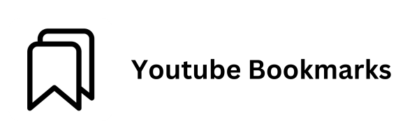

# Youtube Bookmarks Chrome Extension (MV3)

Now you can bookmark your favorite YouTube videos with ease

## Features

- Create, Rename, and Delete Bookmarks
- Minimalistic  White Desgin
- Makes use of Chrome Manifest Version 3 

## How To Use
- Click on a "blue-plus" icon near the video controls (refresh the page if you don't see it)
## Credits

This extension uses icons from the following artists:

- [IonutNeagu](https://www.svgrepo.com/svg/490436/trash-can)
- [bypeople](https://www.svgrepo.com/svg/512680/plus-1469)
- [Adam Whitcroft](https://www.svgrepo.com/svg/514197/play)
- [Ionicons](https://www.svgrepo.com/svg/326519/bookmarks-outline)
- [Mariusz Ostrowski](https://www.svgrepo.com/svg/446233/left-arrow-1)

## Installation

### Locally:

1- Download the ZIP and extract its contents

2 - Open Chrome and navigate to chrome://extensions/

3 - Enable Developer Mode

4 - Click on "Load Unpacked" and select the extracted folder to install the extension

### Chrome Store:

Coming Soon
